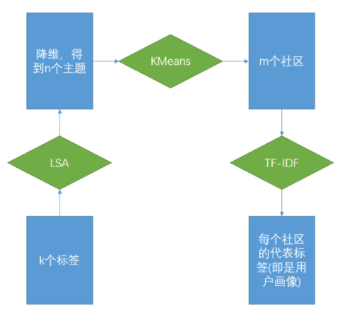
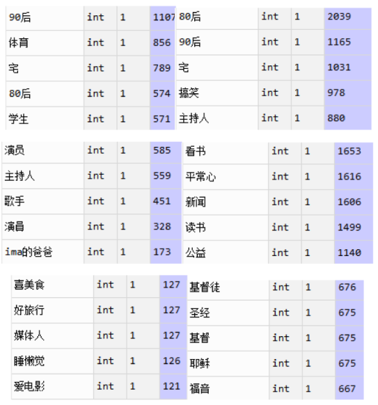
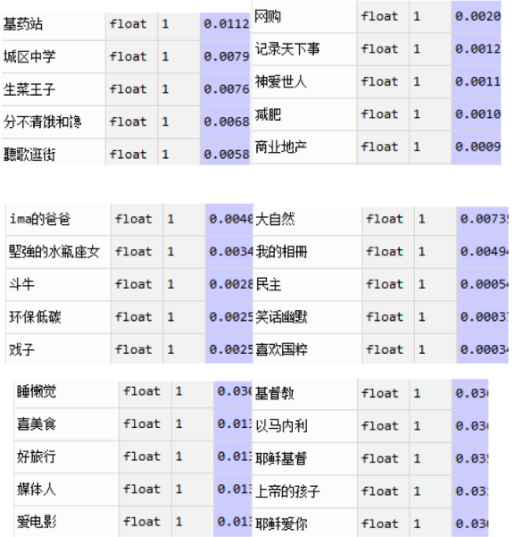

# 基于LSA模型的微博用户分组与基于TF-IDF的用户画像分析
## 1. 背景
### 1.1 LSA模型

LSA模型之前一节课已经用到，这里不再赘述。在本次实验中，考虑到LSA与PCA的本质都是SVD矩阵分解，我们可以利用sklearn库中的PCA来实现隐层语义分析，并达到降维的目的。

### 1.2 KMeans分类算法

K-means算法是最为经典的基于划分的聚类方法，K-means算法的基本思想是：以空间中k个点为中心进行聚类，对最靠近他们的对象归类。通过迭代的方法，逐次更新各聚类中心的值，直至得到最好的聚类结果。

### 1.3 用户画像

用户画像，又称人群画像，是根据用户人口统计学信息、社交关系、偏好习惯和消费行为等信息而抽象出来的标签化画像。构建用户画像的核心工作即是给用户贴“标签”，而标签中部分是根据用户的行为数据直接得到。

### 1.4 TF-IDF

TF-IDF(Term Frequency-Inverse Document Frequency, 词频-逆文件频率)。是一种用于资讯检索与资讯探勘的常用加权技术。TF-IDF是一种统计方法，用以评估一字词对于一个文件集或一个语料库中的其中一份文件的重要程度。字词的重要性随着它在文件中出现的次数成正比增加，但同时会随着它在语料库中出现的频率成反比下降。我们在对用户实现了分类之后，可以再利用TF-DF对每一类用户寻找最重要的标签作为代表。

词频 (term frequency, TF) 指的是某一个给定的词语在该文件中出现的次数。这个数字通常会被归一化(一般是词频除以文章总词数), 以防止它偏向长的文件。（同一个词语在长文件里可能会比短文件有更高的词频，而不管该词语重要与否。）

$$
TF_w = \dfrac{count(word, doc)}{ size(doc)}
$$
逆向文件频率 (inverse document frequency, IDF) IDF的主要思想是：如果包含词条t的文档越少, IDF越大，则说明词条具有很好的类别区分能力。某一特定词语的IDF，可以由总文件数目除以包含该词语之文件的数目，再将得到的商取对数得到。
$$
IDF_w=log(\dfrac{num(doc)}{num(doc,word)+1})
$$
分母之所以要加1，是为了避免分母为0. 　某一特定文件内的高词语频率，以及该词语在整个文件集合中的低文件频率，可以产生出高权重的TF-IDF。因此，TF-IDF倾向于过滤掉常见的词语，保留重要的词语。 
在这次的实验中，我们把分好的N个类的用户的所有的标签组成一个“doc”，这样我们就可以一共获得N个doc，从而可以计算每个doc里面的每一个标签词的TF-IDF值。

## 1.5 “Stop-Labels”

我们的实验中，提到了一个停用标签的概念。考虑到许多如同，“音乐”、“电影”这样的标签，并不具有十分显著的标签信息。我们在进行实验的时候可以将其剔除。具体操作中，我们讲那些超过3000个人标注的标签剔除。

## 2 实验

整个工作流如图所示：

1. 我们导入数据之后发现，有些weights高达五位数，有些却又是小于0.1的weights，我们猜测不同用户之间的weights差距如此之大，是考虑了他们的社交关系中影响力的重要性。但是，我们在给用户的兴趣爱好分组的时候，他的社交影响力并不是关键因素，因此，我们对这些weights做了一个归一化，以保证在对用户的标签来做分类的时候的统一。
2. 我们把少于10个用户标注的标签剔除，可以认为这些是噪声标签。
3. 接着，我们利用PCA将用户矩阵降维到50。这里也相当于是利用了LSA的方法。
4. 最后我们利用KMeans做分类。

## 3 结果

我们以分6个类别为例，最后可以发现，如果按照单纯BoW模型，我们用每一组频率最高的5个标签如图，得到如图6个组的用户画像：

我们可以猜测：

- 第一类是喜欢运动的年轻男生，
- 第二类是年轻女生，
- 第三类是明星艺人，
- 第四类试一些喜欢读书、热心公益的中年人，
- 第五类是一些喜爱美食与旅游的媒体人，
- 第六类则是基督教徒。

如果我们采用TF-IDF，我们的得到的这六组相应的用户画像则是如图：

对比只用词袋模型，我们利用TF-IDF模型更有特定性。

- 第一类，我们在第一种方法中猜测是年轻男生，这里中学得到了应证。	
- 第二类，喜欢网购与减肥，也符合我们猜测的年轻女生的用户。
- 第三类的戏子等也确实暗示可能是艺人。
- 第四类，喜欢关注自然、民主等，也符合上面的中年人预测。
- 第五第六基本与BoW模型一致。

## 4 讨论

就我们的实验结果而言，似乎TF-IDF对用户画像描述的反而不如简单的词袋模型直观。我们猜测我们在实验部分中，仅仅删除了少于10个用户标注的标签，其实还是没有很好的去除一些噪声标签。在后续的工作中，我们可以调整这个阈值，来观测TF-IDF方法是否会对用户画像描述的更加清晰。